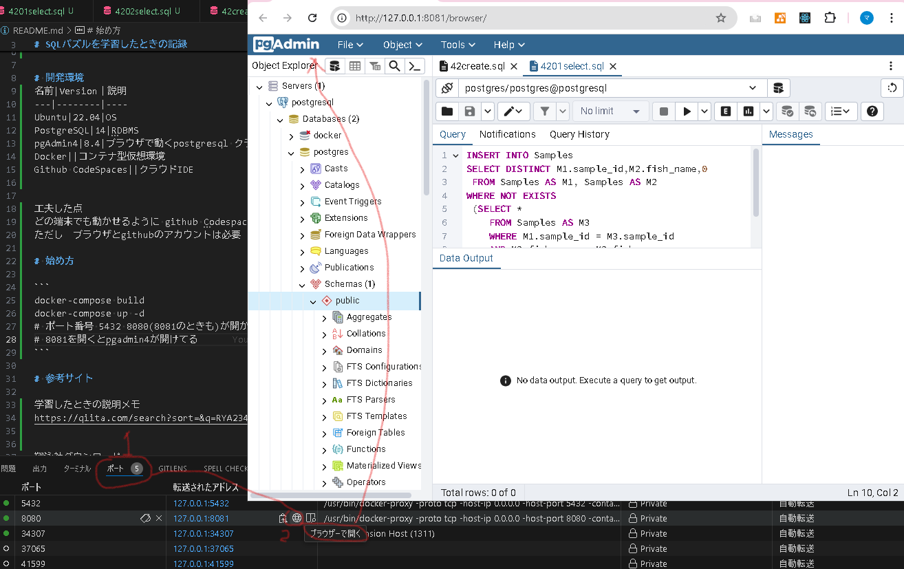

# SQL_Puzzle_Learning

# SQLパズルを学習したときの記録
書籍「SQLパズル」の問題を解くために作ったリポジトリです。


# 開発環境
名前|Version｜説明
---|--------|----
Ubuntu|22.04|OS
PostgreSQL|14|RDBMS
pgAdmin4|8.4|ブラウザで動くpostgresql クライアントソフト
Docker||コンテナ型仮想環境
Github CodeSpaces||クラウドIDE


工夫した点
どの端末でも動かせるように github Codespacesを使ったところです。
ただし　ブラウザとgithubのアカウントは必要
欠点としては、
　一定時間操作しないと切れること
　無料枠を超えると課金


# 始め方

```
docker-compose build
docker-compose up -d
# ポート番号 5432 8080(8081のときも)が開かれるので,8081をブラウザで表示する下の画像参照
# 8081を開くとpgadmin4が開ける。
```


# 参考サイト

学習したときの説明メモ
https://qiita.com/search?sort=&q=RYA234++tag%3ASQL


翔泳社ダウンロード
https://www.shoeisha.co.jp/book/download/9784798114132

『SQLパズル 第2版』サポートページ

https://mickindex.sakura.ne.jp/database/db_support_sqlpuzzle.html

コードドキュメント(使ってない)

https://stackoverflow.com/questions/1085672/sql-comment-header-examples

ベン図メーカー
http://benzumaker.com/

We use something like this and very useful for me .

/*  
Description:   
Author:   
Create Date: 
Param:   
Return:   
Modified Date:  
Modification:   
*/  